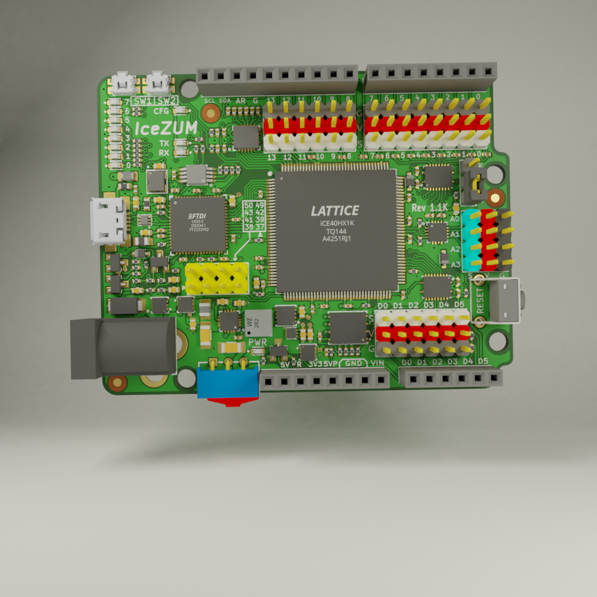
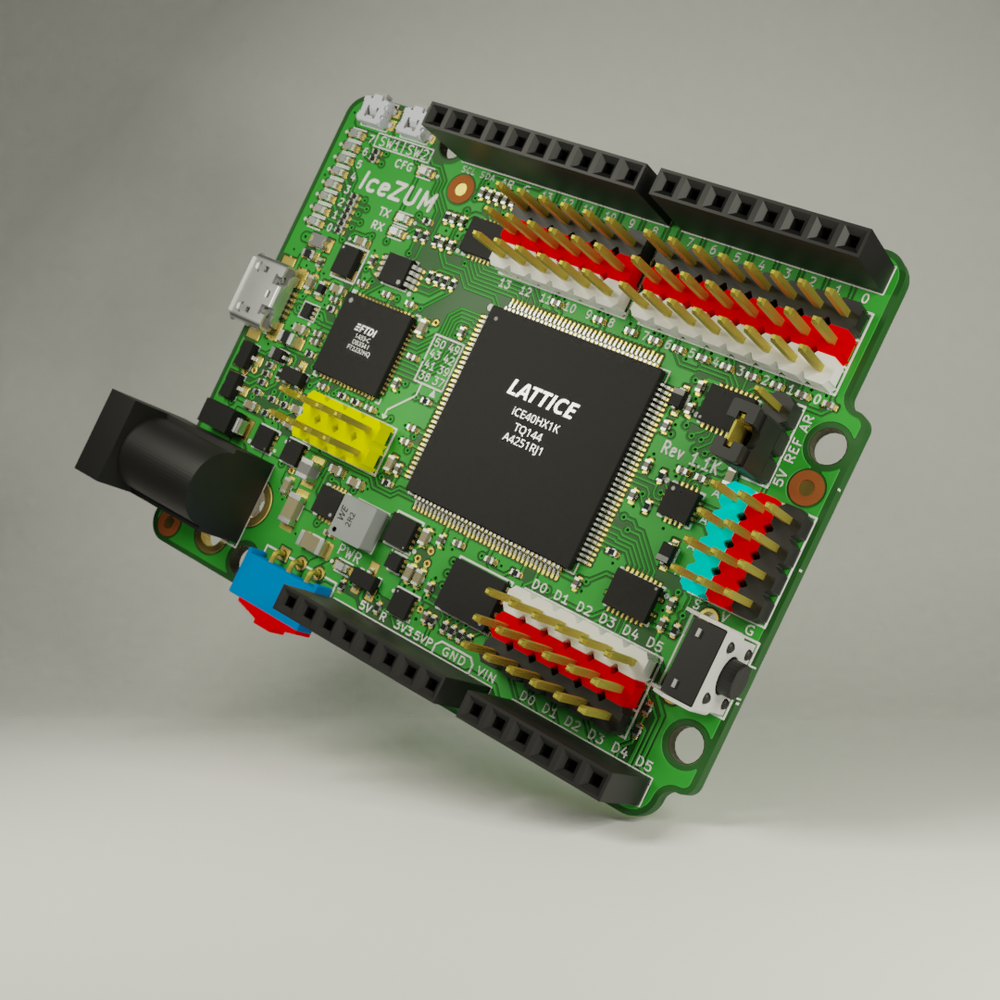

# KiBlenderCad
Based on the work of @PCB-Arts: https://github.com/PCB-Arts/stylized-blender-setup
Automatically create a blender file of a kicad_pcb based on a template:

* Export layers in SVG files
* Export VRML file
* Convert SVG files to PNG textures thanks to inkscape
* Integrate PNG layers and maps textures in Blender files

```
generator.py -vvvvv "D:\MyPcb\MyPcb.kicad_pcb"
```


### Important

* You need to apply the VRML color import patch on your Blender installation:
https://developer.blender.org/T71232
  
* You need to install kicad2vrml inside *bin* directory of your Kicad installation: 
  * Compile kicad2vrml from https://github.com/diorcety/kicad/tree/kicad2vrml
  * Use Windows executable available for Kicad 5.1.x in [kicad2vrml.7z](./kicad2vrml.7z)
  
### Examples
## [Icezum](https://github.com/FPGAwars/icezum)

- Blender output just after the script




- After few minutes and some material replacements

